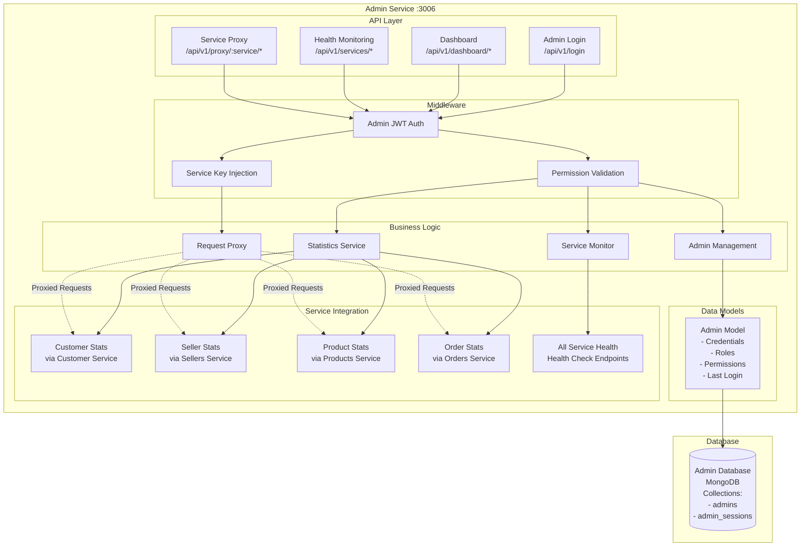
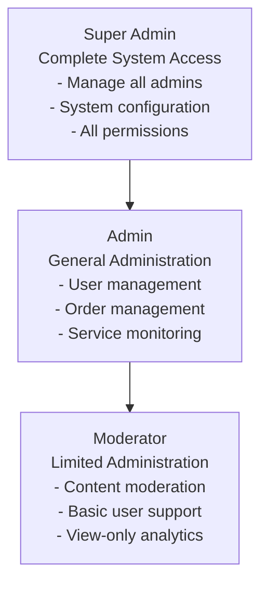
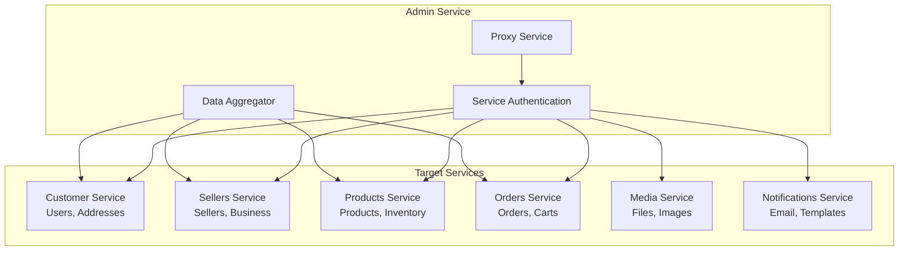

# Admin Service Architecture

## Service Overview
The Admin Service provides administrative panel functionality including authentication, dashboard statistics, service health monitoring, and proxying requests to other microservices. It serves as the central management interface for the e-commerce platform.

## Architecture Diagram



## Component Responsibilities

### API Layer
- **Login Routes**: Admin authentication and session management
- **Dashboard Routes**: Statistics aggregation and dashboard data
- **Health Routes**: Service monitoring and health checks
- **Proxy Routes**: Secure proxy to all microservices

### Middleware
- **Admin Authentication**: JWT token validation for admin users
- **Permission Validation**: Role-based access control enforcement
- **Service Key Injection**: Automatic service key insertion for proxied requests

### Business Logic
- **Admin Management**: Admin account management and authentication
- **Dashboard Service**: Statistics collection and aggregation
- **Health Service**: Service monitoring and availability checking
- **Proxy Service**: Secure request forwarding to microservices

## Admin Role Hierarchy



### Permission Matrix

| Operation | Super Admin | Admin | Moderator |
|-----------|-------------|-------|-----------|
| Manage Admins | ✅ | ❌ | ❌ |
| System Config | ✅ | ❌ | ❌ |
| User Management | ✅ | ✅ | ❌ |
| Seller Management | ✅ | ✅ | ❌ |
| Order Management | ✅ | ✅ | ❌ |
| View Analytics | ✅ | ✅ | ✅ |
| Service Health | ✅ | ✅ | ✅ |
| Content Moderation | ✅ | ✅ | ✅ |

## Data Flow Patterns

### Admin Authentication Flow
1. **Login Request** → Credential validation → Account status check
2. **Password Verification** → Bcrypt comparison → Account lockout check
3. **Role Validation** → Active admin check → Permission loading
4. **Session Creation** → JWT token generation → Login tracking
5. **Response** → Admin profile → Token pair → Dashboard redirect

### Dashboard Statistics Flow
1. **Authentication** → Admin token validation → Permission check
2. **Service Health Check** → Parallel service pings → Availability status
3. **Statistics Collection** → Concurrent service API calls → Data aggregation
4. **Error Handling** → Service unavailable fallback → Partial data response
5. **Response** → Aggregated statistics → Service status → Dashboard data

### Service Proxy Flow
1. **Request Reception** → Admin authentication → Service identification
2. **Service Key Injection** → Remove admin token → Add service key
3. **Request Forwarding** → Target service API → Header management
4. **Response Processing** → Service response → Error handling
5. **Response Relay** → Admin client → Proper error formatting

## Database Schema

### Admins Collection
```javascript
{
  _id: ObjectId,
  firstName: String,
  lastName: String,
  email: String (unique),
  password: String (bcrypt hash),
  phone: String,
  role: String, // 'super_admin', 'admin', 'moderator'
  permissions: [{
    resource: String, // 'manage_users', 'manage_sellers', etc.
    actions: [String] // ['create', 'read', 'update', 'delete']
  }],
  isActive: Boolean,
  lastLogin: Date,
  loginAttempts: Number,
  lockUntil: Date,
  profileImage: String (media UUID),
  preferences: {
    theme: String, // 'light', 'dark'
    language: String,
    timezone: String,
    notifications: {
      email: Boolean,
      push: Boolean,
      sms: Boolean
    }
  },
  createdAt: Date,
  updatedAt: Date,
  createdBy: ObjectId
}
```

### Admin Sessions Collection
```javascript
{
  _id: ObjectId,
  adminId: ObjectId,
  sessionId: String (unique),
  ipAddress: String,
  userAgent: String,
  location: {
    country: String,
    city: String,
    coordinates: [Number] // [longitude, latitude]
  },
  isActive: Boolean,
  loginAt: Date,
  logoutAt: Date,
  expiresAt: Date,
  activities: [{
    action: String,
    resource: String,
    timestamp: Date,
    metadata: Object
  }]
}
```

## Service Integration Architecture

### Service Communication Pattern


### Statistics Aggregation Flow
1. **Parallel Service Calls** → Concurrent HTTP requests → All services
2. **Error Resilience** → Service timeout handling → Partial success
3. **Data Transformation** → Service-specific response parsing → Standardization
4. **Aggregation Logic** → Data combination → Metrics calculation
5. **Cache Strategy** → Result caching → Performance optimization

## Advanced Features

### Service Health Monitoring
- **Real-time Health Checks**: Continuous service availability monitoring
- **Response Time Tracking**: Service performance metrics
- **Error Rate Monitoring**: Service failure detection
- **Automatic Alerting**: Critical service failure notifications
- **Historical Health Data**: Service uptime and performance history

### Request Proxying System
- **Transparent Proxying**: Seamless request forwarding to services
- **Authentication Translation**: Admin token to service key conversion
- **Request/Response Modification**: Header manipulation and validation
- **Error Handling**: Graceful service failure management
- **Audit Logging**: Complete request/response logging

### Dashboard Analytics
- **Real-time Metrics**: Live system statistics and KPIs
- **Multi-service Aggregation**: Data from all microservices
- **Visual Data Representation**: Charts, graphs, and metrics
- **Customizable Dashboards**: Role-based dashboard configurations
- **Export Capabilities**: Data export and reporting features

## Security Features

### Authentication Security
- **Multi-Factor Authentication**: (Future enhancement)
- **Session Management**: Secure session handling with expiration
- **IP Whitelisting**: Administrative access restrictions
- **Account Lockout**: Brute force attack prevention
- **Password Policies**: Strong password requirements

### Authorization Security
- **Role-Based Access Control**: Granular permission system
- **Resource-Level Permissions**: Fine-grained access control
- **Operation Auditing**: Complete admin activity logging
- **Privilege Escalation Prevention**: Strict role boundaries

### Service Communication Security
- **Service Key Management**: Secure inter-service authentication
- **Request Validation**: Input sanitization and validation
- **Response Filtering**: Sensitive data filtering
- **Encrypted Communication**: HTTPS/TLS enforcement

## Performance Optimization

### Caching Strategy
- **Dashboard Data Caching**: Frequently accessed statistics
- **Service Health Caching**: Health check result caching
- **Admin Session Caching**: Active session data
- **Permission Caching**: Role and permission data

### Concurrent Operations
- **Parallel Service Calls**: Simultaneous service requests
- **Async Processing**: Non-blocking operation handling
- **Connection Pooling**: Efficient HTTP connection management
- **Request Batching**: Bulk operation optimization

### Database Optimization
- **Query Optimization**: Efficient database queries
- **Index Strategy**: Proper database indexing
- **Connection Management**: Database connection pooling
- **Data Aggregation**: Optimized aggregation pipelines

## Monitoring and Analytics

### Admin Activity Monitoring
- **Login Tracking**: Admin authentication events
- **Action Auditing**: All administrative operations
- **Permission Usage**: Role and permission utilization
- **Session Analysis**: Admin session patterns and behavior

### System Performance Monitoring
- **Service Response Times**: Inter-service communication performance
- **Error Rate Tracking**: Service failure rates and patterns
- **Resource Utilization**: System resource usage monitoring
- **Capacity Planning**: Growth and scaling metrics

### Business Intelligence
- **User Growth Analytics**: Customer and seller acquisition
- **Revenue Analytics**: Sales and revenue tracking
- **Product Performance**: Product popularity and sales metrics
- **Order Analytics**: Order processing and fulfillment metrics

## Error Handling and Resilience

### Service Failure Handling
- **Circuit Breaker Pattern**: Automatic service failure detection
- **Graceful Degradation**: Partial functionality during outages
- **Retry Logic**: Intelligent request retry mechanisms
- **Fallback Responses**: Default responses for unavailable services

### Data Consistency
- **Eventual Consistency**: Handling distributed data inconsistencies
- **Conflict Resolution**: Data conflict resolution strategies
- **Transaction Management**: Cross-service transaction handling
- **Data Synchronization**: Service data consistency maintenance

## Deployment Considerations

### High Availability
- **Load Balancing**: Multiple admin service instances
- **Database Clustering**: MongoDB replica sets
- **Service Discovery**: Dynamic service endpoint management
- **Health Check Integration**: Load balancer health check support

### Scalability
- **Horizontal Scaling**: Multiple service instances
- **Database Sharding**: Data distribution across shards
- **Cache Scaling**: Distributed caching solutions
- **Service Mesh**: Advanced service communication management