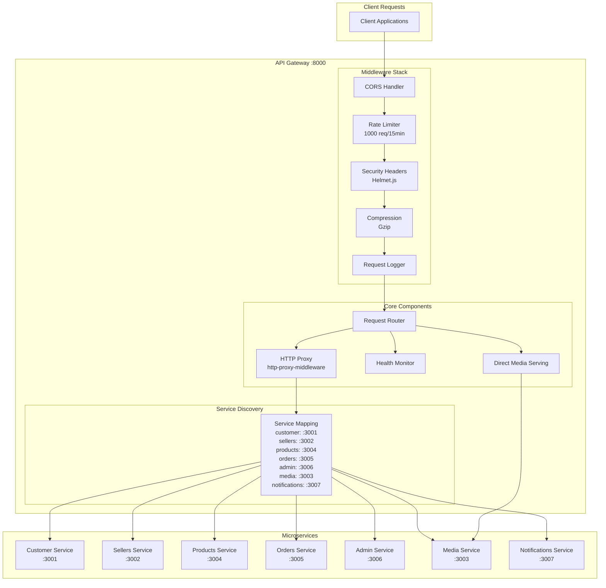

# API Gateway Architecture

## Service Overview
The API Gateway serves as the single entry point for all client requests, providing request routing, load balancing, security, rate limiting, and centralized logging.

## Architecture Diagram



## Component Responsibilities

### Middleware Stack
- **CORS Handler**: Manages cross-origin resource sharing policies
- **Rate Limiter**: Prevents abuse with 1000 requests per 15 minutes per IP
- **Security Headers**: Applies security headers via Helmet.js
- **Compression**: Gzip compression for response optimization
- **Request Logger**: Logs all requests in development mode

### Core Components
- **Request Router**: Routes requests based on URL patterns
- **HTTP Proxy**: Forwards requests to appropriate microservices
- **Health Monitor**: Tracks service availability and health status
- **Direct Media Serving**: Optimized media file serving

### Service Discovery
- **Service Mapping**: Static configuration mapping services to URLs
- **Path Rewriting**: Converts `/api/customer/*` to `/api/v1/*`
- **Load Balancing**: Single instance routing (extensible to multiple)

## Request Flow

1. **Client Request** → CORS validation → Rate limiting check
2. **Security Processing** → Helmet headers → Compression
3. **Request Logging** → Development mode logging
4. **Route Matching** → Service identification → Path rewriting
5. **Service Forwarding** → HTTP proxy → Target service
6. **Response Processing** → Headers injection → Client response

## Key Features

### Security
- **Rate Limiting**: Configurable per-IP request limits
- **Security Headers**: Comprehensive security header management
- **CORS Policy**: Flexible cross-origin configuration
- **Request Validation**: Input sanitization and validation

### Performance
- **Response Compression**: Automatic Gzip compression
- **Connection Reuse**: HTTP keep-alive for efficiency
- **Media Optimization**: Direct file serving bypassing JSON parsing
- **Caching Headers**: Appropriate cache control for static assets

### Monitoring
- **Health Endpoints**: Service health aggregation
- **Request Logging**: Comprehensive request/response logging
- **Error Handling**: Graceful service failure handling
- **Service Status**: Real-time service availability tracking

## Configuration

### Environment Variables
```env
PORT=8000
CORS_ORIGIN=*
RATE_LIMIT_MAX=1000
NODE_ENV=production

# Service URLs
CUSTOMER_SERVICE_URL=http://localhost:3001
SELLERS_SERVICE_URL=http://localhost:3002
MEDIA_SERVICE_URL=http://localhost:3003
PRODUCTS_SERVICE_URL=http://localhost:3004
ORDERS_SERVICE_URL=http://localhost:3005
ADMIN_SERVICE_URL=http://localhost:3006
NOTIFICATIONS_SERVICE_URL=http://localhost:3007
```

### Service Routing Rules
```javascript
const services = {
  customer: {
    target: 'http://localhost:3001',
    pathRewrite: { '^/api/customer': '/api/v1' }
  },
  sellers: {
    target: 'http://localhost:3002', 
    pathRewrite: { '^/api/sellers': '/api/v1' }
  }
  // ... other services
};
```

## Error Handling

### Service Unavailable
- Graceful degradation when services are down
- Appropriate HTTP status codes and error messages
- Service health status in error responses

### Request Failures
- Timeout handling (30 seconds default)
- Connection error management
- Proper error message formatting

### Circuit Breaker Pattern (Future Enhancement)
- Automatic service failure detection
- Temporary request blocking for failed services
- Automatic recovery when services come back online