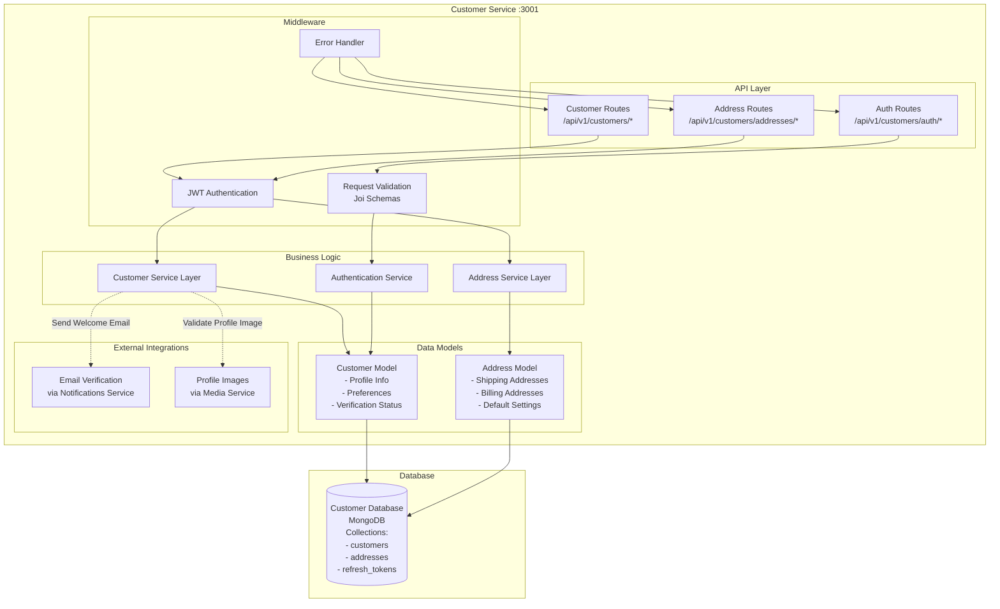

# Customer Service Architecture

## Service Overview
The Customer Service manages customer accounts, authentication, profiles, and addresses. It provides secure customer registration, login functionality, profile management, and address book features.

## Architecture Diagram



## Component Responsibilities

### API Layer
- **Customer Routes**: Profile management, preferences, account settings
- **Address Routes**: Shipping/billing address CRUD operations
- **Auth Routes**: Registration, login, password reset, email verification

### Middleware
- **JWT Authentication**: Token validation and user context injection
- **Input Validation**: Request schema validation using Joi
- **Error Handler**: Centralized error processing and response formatting

### Business Logic
- **Customer Service**: Core customer operations and business rules
- **Address Service**: Address management and validation
- **Auth Service**: Authentication, authorization, and session management

### Data Models
- **Customer Model**: User profile, preferences, verification status, metrics
- **Address Model**: Multiple address support with default address handling

## Data Flow Patterns

### Customer Registration Flow
1. **Request Validation** → Schema validation → Data sanitization
2. **Duplicate Check** → Email uniqueness validation
3. **Password Processing** → Bcrypt hashing → Salt generation
4. **Database Creation** → Customer record → Initial preferences
5. **Token Generation** → JWT access token → Refresh token
6. **Email Verification** → Welcome email → Verification link
7. **Response** → Success response → Token pair

### Authentication Flow
1. **Credentials Validation** → Email/password verification
2. **Account Status Check** → Active status → Email verification
3. **Password Verification** → Bcrypt comparison
4. **Token Generation** → New JWT tokens → Session tracking
5. **Login Tracking** → Last login update → Login metrics
6. **Response** → User profile → Token pair

### Profile Management Flow
1. **Authentication** → JWT validation → User context
2. **Data Validation** → Schema validation → Business rules
3. **Media Validation** → Profile image validation (if provided)
4. **Database Update** → Profile update → Audit trail
5. **Cache Invalidation** → Session cache update
6. **Response** → Updated profile data

## Database Schema

### Customer Collection
```javascript
{
  _id: ObjectId,
  firstName: String,
  lastName: String,
  email: String (unique),
  password: String (bcrypt hash),
  phone: String,
  dateOfBirth: Date,
  gender: String,
  profileImage: String (media UUID),
  preferences: {
    newsletter: Boolean,
    smsNotifications: Boolean,
    language: String,
    currency: String
  },
  isActive: Boolean,
  isVerified: Boolean,
  emailVerified: Boolean,
  phoneVerified: Boolean,
  totalOrders: Number,
  totalSpent: Number,
  loyaltyPoints: Number,
  createdAt: Date,
  updatedAt: Date,
  lastLogin: Date
}
```

### Address Collection
```javascript
{
  _id: ObjectId,
  customerId: ObjectId,
  type: String, // 'home', 'work', 'other'
  label: String,
  firstName: String,
  lastName: String,
  company: String,
  street: String,
  street2: String,
  city: String,
  state: String,
  country: String,
  postalCode: String,
  phone: String,
  isDefault: Boolean,
  createdAt: Date,
  updatedAt: Date
}
```

## Security Features

### Authentication Security
- **Password Hashing**: Bcrypt with 12 salt rounds
- **JWT Tokens**: 24-hour access token, 7-day refresh token
- **Token Rotation**: Refresh token rotation on use
- **Session Management**: Secure session handling

### Data Protection
- **Input Sanitization**: XSS prevention and data cleaning
- **SQL Injection Prevention**: Parameterized queries
- **Rate Limiting**: Login attempt limitations
- **Account Lockout**: Temporary lockout after failed attempts

### Privacy Compliance
- **Data Encryption**: Sensitive data encryption at rest
- **GDPR Compliance**: Data export and deletion capabilities
- **Audit Trail**: Complete operation logging
- **Consent Management**: Privacy preference tracking

## External Integrations

### Notifications Service
- **Welcome Emails**: New customer onboarding
- **Email Verification**: Account activation emails
- **Password Reset**: Secure password reset links
- **Marketing Communications**: Newsletter and promotional emails

### Media Service
- **Profile Images**: Avatar upload and management
- **Image Validation**: File type and size validation
- **Image Optimization**: Automatic thumbnail generation
- **Secure Serving**: UUID-based image serving

## Performance Optimization

### Database Optimization
- **Indexing**: Email, customer ID, and query optimization indexes
- **Connection Pooling**: MongoDB connection management
- **Query Optimization**: Efficient database queries
- **Pagination**: Large dataset handling

### Caching Strategy
- **Session Caching**: User session data caching
- **Profile Caching**: Frequently accessed profile data
- **Address Caching**: Address book caching
- **Token Caching**: JWT token validation caching

## Monitoring and Health

### Health Checks
- **Database Connectivity**: MongoDB connection status
- **External Services**: Dependency health checks
- **Resource Usage**: Memory and CPU monitoring
- **Response Times**: API performance metrics

### Logging
- **Authentication Events**: Login/logout tracking
- **Profile Changes**: Audit trail for profile modifications
- **Error Tracking**: Comprehensive error logging
- **Performance Metrics**: Request timing and throughput