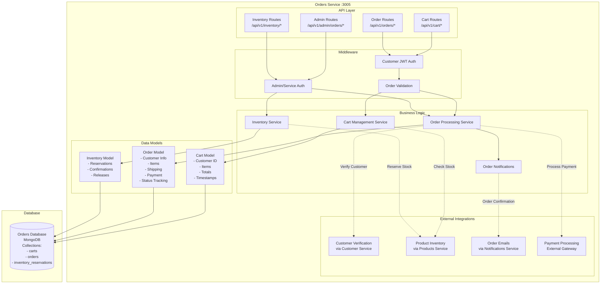
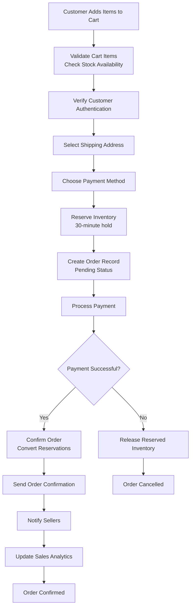

# Orders Service Architecture

## Service Overview
The Orders Service manages shopping cart operations, order processing, inventory reservations, and order fulfillment. It integrates with multiple services to provide a complete order management solution.

## Architecture Diagram



## Component Responsibilities

### API Layer
- **Cart Routes**: Shopping cart CRUD operations, item management
- **Order Routes**: Order placement, tracking, cancellation, history
- **Admin Order Routes**: Order management, status updates, bulk operations
- **Inventory Routes**: Stock reservations, confirmations, releases

### Middleware
- **Customer Authentication**: JWT validation for customer operations
- **Admin Authentication**: Service key validation for admin/service operations
- **Order Validation**: Business rule enforcement and data validation

### Business Logic
- **Cart Service**: Shopping cart management, item calculations
- **Order Service**: Order processing, status management, payments
- **Inventory Service**: Stock reservations and inventory coordination
- **Notification Service**: Order-related email notifications

## Order Processing Workflow



## Data Flow Patterns

### Cart Management Flow
1. **Add to Cart** → Authentication → Product validation → Stock check
2. **Stock Verification** → Products service API → Availability confirmation
3. **Cart Update** → Item addition/update → Total recalculation
4. **Persistence** → Database update → Response to client
5. **Real-time Sync** → Cart state synchronization across sessions

### Order Placement Flow
1. **Cart Validation** → Items exist → Stock available → Customer authenticated
2. **Address Verification** → Customer service → Valid shipping address
3. **Inventory Reservation** → Products service → 30-minute stock hold
4. **Order Creation** → Database record → Unique order number generation
5. **Payment Processing** → External gateway → Transaction handling
6. **Order Confirmation** → Reservation conversion → Stock update
7. **Notifications** → Customer confirmation → Seller notifications
8. **Analytics Update** → Sales metrics → Revenue tracking

### Multi-Seller Order Processing
1. **Order Splitting** → Group items by seller → Individual seller orders
2. **Seller Notification** → Each seller notified → Individual order details
3. **Fulfillment Tracking** → Per-seller status → Overall order status
4. **Shipping Coordination** → Multiple shipments → Tracking consolidation
5. **Status Aggregation** → Individual statuses → Overall order status

## Database Schema

### Cart Collection
```javascript
{
  _id: ObjectId,
  customerId: String,
  items: [{
    productId: String,
    sellerId: String,
    productName: String,
    productImage: String,
    quantity: Number,
    price: Number,
    totalPrice: Number,
    availableStock: Number,
    addedAt: Date
  }],
  totalItems: Number,
  totalAmount: Number,
  currency: String,
  lastUpdated: Date,
  createdAt: Date,
  expiresAt: Date // Auto-cleanup after 30 days
}
```

### Orders Collection
```javascript
{
  _id: ObjectId,
  orderNumber: String (unique),
  customerId: String,
  customerName: String,
  customerEmail: String,
  items: [{
    productId: String,
    sellerId: String,
    productName: String,
    productImage: String,
    quantity: Number,
    unitPrice: Number,
    totalPrice: Number,
    status: String, // 'reserved', 'confirmed', 'cancelled', 'fulfilled'
    reservedAt: Date,
    confirmedAt: Date
  }],
  
  // Order totals
  subtotal: Number,
  tax: Number,
  shippingFee: Number,
  discount: Number,
  totalAmount: Number,
  currency: String,
  
  // Shipping information
  shippingAddress: {
    addressLine1: String,
    addressLine2: String,
    city: String,
    state: String,
    country: String,
    postalCode: String,
    contactName: String,
    contactPhone: String
  },
  
  // Order status and tracking
  status: String, // 'pending', 'confirmed', 'processing', 'shipped', 'delivered', 'cancelled'
  paymentMethod: String, // 'cod', 'online', 'wallet'
  paymentStatus: String, // 'pending', 'paid', 'failed', 'refunded'
  
  // Multi-seller tracking
  sellerStatuses: [{
    sellerId: String,
    status: String,
    updatedAt: Date,
    notes: String,
    trackingNumber: String,
    estimatedDelivery: Date
  }],
  
  // Timestamps
  placedAt: Date,
  confirmedAt: Date,
  shippedAt: Date,
  deliveredAt: Date,
  cancelledAt: Date,
  
  // Additional information
  notes: String,
  cancelReason: String,
  refundAmount: Number,
  
  // Inventory management
  reservationExpiry: Date,
  
  createdAt: Date,
  updatedAt: Date
}
```

### Inventory Reservations Collection
```javascript
{
  _id: ObjectId,
  orderId: String,
  customerId: String,
  reservations: [{
    productId: String,
    sellerId: String,
    quantity: Number,
    unitPrice: Number,
    reservedAt: Date,
    expiresAt: Date,
    status: String // 'active', 'confirmed', 'expired', 'cancelled'
  }],
  totalItems: Number,
  totalValue: Number,
  status: String, // 'active', 'confirmed', 'expired', 'cancelled'
  createdAt: Date,
  updatedAt: Date
}
```

## Advanced Features

### Inventory Reservation System
- **Temporary Holds**: 30-minute inventory reservations
- **Automatic Expiration**: Auto-release expired reservations
- **Conflict Resolution**: Handle concurrent reservation requests
- **Stock Synchronization**: Real-time stock level coordination
- **Reservation Analytics**: Track reservation conversion rates

### Multi-Seller Order Management
- **Order Splitting**: Automatic seller-based order segmentation
- **Individual Tracking**: Per-seller status and tracking
- **Consolidated View**: Customer-facing unified order status
- **Seller Notifications**: Targeted seller order alerts
- **Shipping Coordination**: Multiple shipment management

### Payment Integration
- **Multiple Payment Methods**: COD, online payments, wallet
- **Payment Gateway Integration**: External payment processor
- **Transaction Tracking**: Payment status monitoring
- **Refund Processing**: Automated refund handling
- **Payment Analytics**: Revenue and payment method analysis

## External Integrations

### Customer Service Integration
- **Customer Verification**: Valid customer account checks
- **Address Validation**: Shipping address verification
- **Customer Profile**: Order history and preferences
- **Loyalty Points**: Points earning and redemption

### Products Service Integration
- **Inventory Checks**: Real-time stock availability
- **Product Information**: Current pricing and details
- **Stock Reservations**: Temporary inventory holds
- **Sales Recording**: Revenue and unit tracking

### Notifications Service Integration
- **Order Confirmations**: Customer order confirmation emails
- **Seller Notifications**: New order alerts to sellers
- **Status Updates**: Order status change notifications
- **Shipping Notifications**: Tracking and delivery updates

### Payment Gateway Integration
- **Transaction Processing**: Secure payment handling
- **Payment Verification**: Transaction status validation
- **Refund Processing**: Automated refund handling
- **Payment Analytics**: Transaction reporting and analysis

## Performance Optimization

### Database Optimization
- **Indexing Strategy**: Order number, customer, seller, and date indexes
- **Query Optimization**: Efficient order lookup and filtering
- **Aggregation Pipelines**: Order analytics and reporting
- **Connection Pooling**: Database connection management

### Inventory Management Performance
- **Reservation Batching**: Bulk reservation operations
- **Cache Integration**: Frequently accessed inventory data
- **Async Processing**: Non-blocking inventory operations
- **Conflict Resolution**: Optimistic locking for concurrent updates

### Order Processing Performance
- **Parallel Processing**: Concurrent order validation steps
- **Caching Strategy**: Cart and order data caching
- **Background Jobs**: Async notification and analytics updates
- **Load Balancing**: Distributed order processing

## Security and Compliance

### Transaction Security
- **Payment Card Industry (PCI)**: Secure payment handling
- **Data Encryption**: Sensitive order data protection
- **Audit Logging**: Complete order operation tracking
- **Access Control**: Customer and admin access restrictions

### Business Rules Enforcement
- **Order Validation**: Comprehensive order data validation
- **Inventory Constraints**: Stock availability enforcement
- **Customer Verification**: Valid customer account requirements
- **Seller Verification**: Active seller status validation

## Monitoring and Analytics

### Order Metrics
- **Conversion Rates**: Cart to order conversion tracking
- **Average Order Value**: Revenue per order analysis
- **Order Fulfillment**: Processing and delivery time metrics
- **Cancellation Rates**: Order cancellation analysis

### Inventory Metrics
- **Reservation Efficiency**: Reservation to conversion rates
- **Stock Turnover**: Inventory movement analysis
- **Out-of-Stock Events**: Stock shortage tracking
- **Reservation Conflicts**: Concurrent access metrics

### Performance Monitoring
- **API Response Times**: Order processing performance
- **Database Performance**: Query execution metrics
- **External Service Integration**: Third-party service health
- **Error Rates**: Failed operation tracking