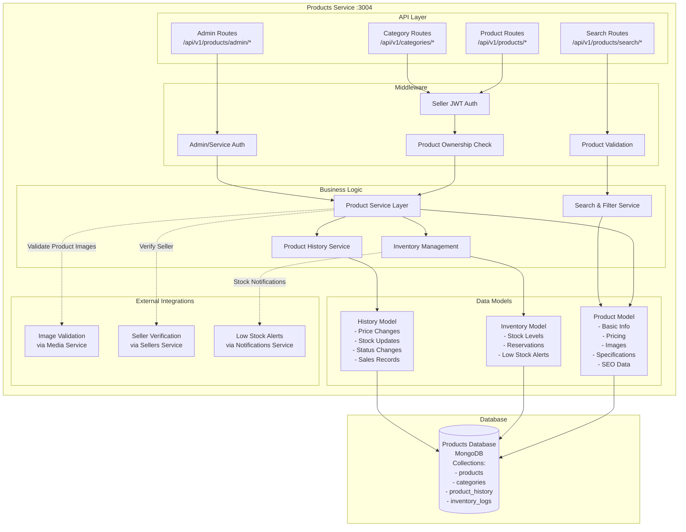

# Products Service Architecture

## Service Overview
The Products Service manages product information, inventory, and product-related operations. It provides CRUD operations for products, inventory management, and inter-service communication endpoints.

## Architecture Diagram



## Component Responsibilities

### API Layer
- **Product Routes**: CRUD operations, product management, seller-specific products
- **Category Routes**: Category management, hierarchical category structure
- **Search Routes**: Advanced search, filtering, sorting capabilities
- **Admin Routes**: Administrative product management, bulk operations

### Middleware
- **Seller Authentication**: JWT token validation for seller operations
- **Admin Authentication**: Service key validation for admin operations
- **Ownership Check**: Ensures sellers can only modify their own products
- **Product Validation**: Schema validation and business rule enforcement

### Business Logic
- **Product Service**: Core product operations, CRUD, business rules
- **Inventory Service**: Stock management, reservations, alerts
- **Search Service**: Search algorithms, filtering, ranking
- **History Service**: Audit trail, change tracking, analytics

### Data Models
- **Product Model**: Complete product information, pricing, media, specifications
- **Inventory Model**: Stock levels, reservation system, alerts
- **History Model**: Change auditing, price history, sales tracking

## Product Lifecycle Management


## Data Flow Patterns

### Product Creation Flow
1. **Authentication** → Seller JWT validation → Permission check
2. **Data Validation** → Schema validation → Business rules
3. **Media Processing** → Image validation → Thumbnail generation
4. **Seller Verification** → Verify seller ownership → Active status check
5. **Database Creation** → Product record → Initial inventory
6. **History Logging** → Creation audit → Change tracking
7. **Response** → Product data → Success confirmation

### Inventory Management Flow
1. **Stock Update Request** → Authentication → Ownership validation
2. **Reservation Check** → Active reservations → Available stock calculation
3. **Stock Adjustment** → Database update → History logging
4. **Alert Processing** → Low stock check → Notification trigger
5. **Analytics Update** → Stock metrics → Reporting data
6. **Response** → Updated stock levels → Alert status

### Search and Discovery Flow
1. **Search Request** → Query parsing → Filter validation
2. **Database Query** → Optimized search → Index utilization
3. **Result Filtering** → Active products → Seller status check
4. **Ranking Algorithm** → Relevance scoring → Popularity weighting
5. **Pagination** → Result slicing → Performance optimization
6. **Response** → Formatted results → Metadata

## Database Schema

### Products Collection
```javascript
{
  _id: ObjectId,
  name: String,
  description: String,
  shortDescription: String,
  price: Number,
  comparePrice: Number,
  costPrice: Number,
  stock: Number,
  lowStockAlert: Number,
  sku: String (unique),
  barcode: String,
  category: String,
  subcategory: String,
  tags: [String],
  sellerId: String,
  images: [{
    media_id: String,
    isPrimary: Boolean,
    altText: String,
    sortOrder: Number
  }],
  specifications: {
    brand: String,
    model: String,
    weight: Number,
    dimensions: {
      length: Number,
      width: Number,
      height: Number
    },
    color: String,
    material: String,
    // ... other specifications
  },
  seo: {
    metaTitle: String,
    metaDescription: String,
    urlSlug: String
  },
  shipping: {
    weight: Number,
    dimensions: Object,
    freeShipping: Boolean,
    shippingClass: String
  },
  status: String, // 'draft', 'active', 'inactive', 'archived'
  isActive: Boolean,
  isFeatured: Boolean,
  totalSold: Number,
  revenue: Number,
  rating: Number,
  reviewCount: Number,
  createdAt: Date,
  updatedAt: Date,
  publishedAt: Date
}
```

### Inventory Collection
```javascript
{
  _id: ObjectId,
  productId: ObjectId,
  sellerId: String,
  stock: Number,
  reservedStock: Number,
  availableStock: Number, // stock - reservedStock
  lowStockAlert: Number,
  restockDate: Date,
  supplier: String,
  cost: Number,
  reservations: [{
    orderId: String,
    customerId: String,
    quantity: Number,
    reservedAt: Date,
    expiresAt: Date,
    status: String // 'active', 'confirmed', 'expired', 'cancelled'
  }],
  stockHistory: [{
    type: String, // 'adjustment', 'sale', 'return', 'reservation'
    quantity: Number,
    previousStock: Number,
    newStock: Number,
    reason: String,
    orderId: String,
    timestamp: Date
  }],
  createdAt: Date,
  updatedAt: Date
}
```

### Product History Collection
```javascript
{
  _id: ObjectId,
  productId: ObjectId,
  sellerId: String,
  type: String, // 'price_change', 'stock_update', 'status_change', 'sale'
  previousValue: Mixed,
  newValue: Mixed,
  quantity: Number,
  orderId: String,
  customerId: String,
  metadata: Object,
  notes: String,
  createdAt: Date
}
```

## Advanced Features

### Search and Filtering Engine
- **Full-Text Search**: Product name and description search
- **Category Filtering**: Hierarchical category navigation
- **Price Range Filtering**: Min/max price boundaries
- **Attribute Filtering**: Specifications-based filtering
- **Availability Filtering**: In-stock products only
- **Seller Filtering**: Products by specific sellers
- **Sorting Options**: Price, popularity, rating, newest

### Inventory Management System
- **Real-Time Stock Tracking**: Immediate inventory updates
- **Reservation System**: Temporary stock holds for pending orders
- **Low Stock Alerts**: Automated notifications to sellers
- **Bulk Stock Updates**: Efficient mass inventory adjustments
- **Stock History**: Complete audit trail of all stock changes
- **Supplier Integration**: (Future enhancement)

### Product Analytics
- **Sales Performance**: Revenue, units sold, conversion rates
- **View Analytics**: Product page views, search appearances
- **Rating Analysis**: Customer satisfaction metrics
- **Seasonal Trends**: Sales patterns and forecasting
- **Competitor Analysis**: Market positioning insights

## External Integrations

### Media Service Integration
- **Image Validation**: File type, size, and quality checks
- **Thumbnail Generation**: Automatic image optimization
- **Gallery Management**: Multiple images per product
- **Image CDN**: Optimized image delivery
- **Bulk Media Operations**: Efficient image processing

### Sellers Service Integration
- **Seller Verification**: Active seller status validation
- **Bulk Seller Data**: Seller information for product listings
- **Permission Validation**: Seller-specific product access
- **Business Profile**: Seller branding on product pages

### Orders Service Integration
- **Inventory Reservations**: Stock holds for pending orders
- **Stock Confirmations**: Convert reservations to sales
- **Availability Checks**: Real-time stock validation
- **Sales Recording**: Revenue and unit tracking

### Notifications Service Integration
- **Low Stock Alerts**: Automated inventory notifications
- **Price Change Alerts**: Customer price drop notifications
- **New Product Announcements**: Marketing communications
- **Seller Notifications**: Product-related seller alerts

## Performance Optimization

### Database Optimization
- **Indexing Strategy**: Search, category, seller, and price indexes
- **Query Optimization**: Efficient search and filter queries
- **Aggregation Pipelines**: Complex analytics and reporting
- **Connection Pooling**: Database connection management

### Caching Strategy
- **Product Caching**: Frequently accessed product data
- **Search Result Caching**: Popular search query results
- **Category Caching**: Category structure and navigation
- **Inventory Caching**: Real-time stock level caching

### Search Performance
- **Search Indexing**: Full-text search indexes
- **Result Pagination**: Efficient large result set handling
- **Query Optimization**: Fast search query execution
- **Relevance Scoring**: Intelligent search result ranking

## Security and Compliance

### Data Security
- **Input Validation**: XSS and injection prevention
- **Access Control**: Seller-specific product access
- **Audit Logging**: Complete operation tracking
- **Data Encryption**: Sensitive data protection

### Business Rules Enforcement
- **Price Validation**: Reasonable pricing constraints
- **Stock Validation**: Negative stock prevention
- **Image Validation**: Inappropriate content filtering
- **Category Validation**: Valid category assignments

## Monitoring and Health

### Performance Metrics
- **Response Times**: API endpoint performance
- **Search Performance**: Query execution times
- **Database Performance**: Query optimization metrics
- **Cache Hit Rates**: Caching effectiveness

### Business Metrics
- **Product Creation**: New product addition rates
- **Search Usage**: Search query patterns and trends
- **Inventory Turnover**: Stock movement analytics
- **Popular Products**: Best-selling items tracking