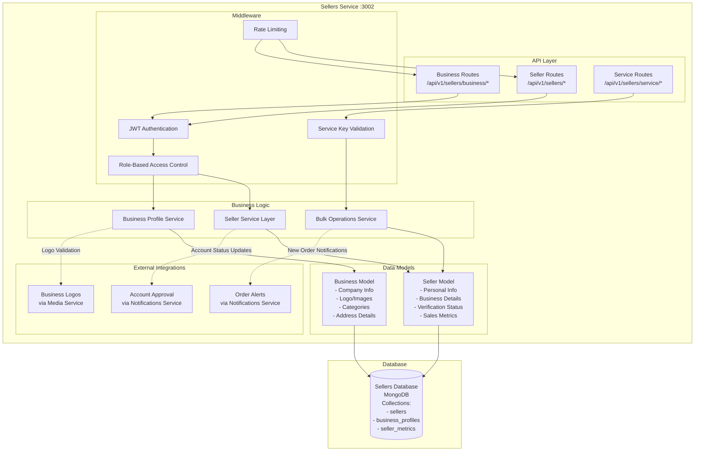
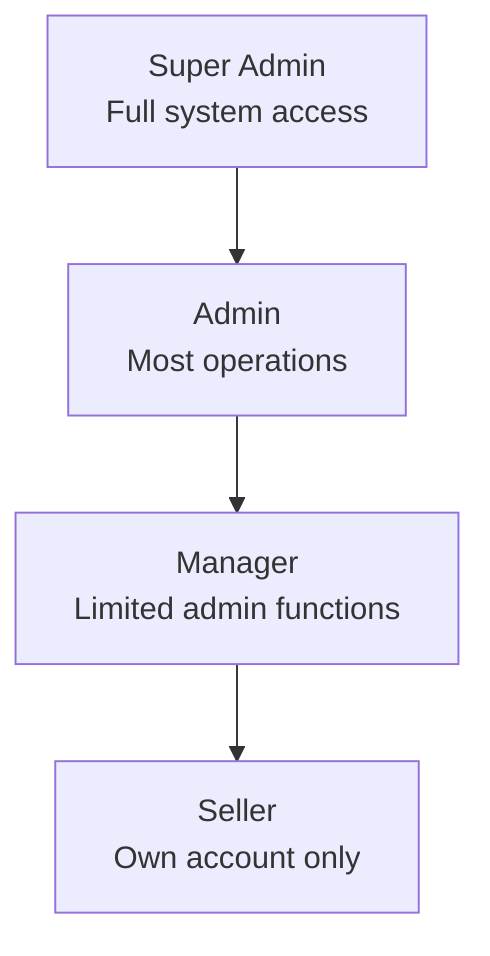

# Sellers Service Architecture

## Service Overview
The Sellers Service manages seller accounts, authentication, business profiles, and seller-related operations. It handles seller registration, login, profile management, and provides seller information to other services.

## Architecture Diagram



## Component Responsibilities

### API Layer
- **Seller Routes**: Authentication, profile management, account operations
- **Business Routes**: Business profile setup, company information, branding
- **Service Routes**: Inter-service communication, bulk operations, data retrieval

### Middleware
- **JWT Authentication**: Seller token validation and context injection
- **Role-Based Access Control**: Permission checking based on seller roles
- **Service Key Validation**: Secure inter-service communication
- **Rate Limiting**: Request throttling and abuse prevention

### Business Logic
- **Seller Service**: Core seller operations, account management, authentication
- **Business Service**: Business profile management, verification processes
- **Bulk Service**: Efficient bulk data operations for other services

### Data Models
- **Seller Model**: Personal information, credentials, metrics, verification status
- **Business Model**: Company details, branding, categories, operational data

## Role-Based Access Control

### Seller Roles Hierarchy


### Permission Matrix
| Operation | Super Admin | Admin | Manager | Seller |
|-----------|-------------|-------|---------|--------|
| Manage All Sellers | ✅ | ✅ | ❌ | ❌ |
| View All Sellers | ✅ | ✅ | ✅ | ❌ |
| Approve Sellers | ✅ | ✅ | ✅ | ❌ |
| Manage Own Profile | ✅ | ✅ | ✅ | ✅ |
| Business Setup | ✅ | ✅ | ✅ | ✅ |
| View Analytics | ✅ | ✅ | ✅ | ✅ |

## Data Flow Patterns

### Seller Registration Flow
1. **Registration Request** → Data validation → Business rules check
2. **Duplicate Prevention** → Email/business name uniqueness
3. **Password Security** → Bcrypt hashing → Salt generation
4. **Account Creation** → Seller record → Business profile stub
5. **Verification Process** → Email verification → Admin approval queue
6. **Token Generation** → JWT tokens → Session establishment
7. **Welcome Communications** → Onboarding emails → Documentation links

### Business Profile Setup Flow
1. **Authentication** → JWT validation → Permission check
2. **Profile Validation** → Business data validation → Logo validation
3. **Media Processing** → Logo upload → Image optimization
4. **Database Update** → Profile completion → Verification status
5. **Notification Trigger** → Profile completion alerts
6. **Response** → Updated business profile

### Bulk Operations Flow
1. **Service Authentication** → Service key validation
2. **Request Processing** → Bulk seller ID validation
3. **Data Retrieval** → Optimized database queries
4. **Response Formatting** → Consistent data structure
5. **Performance Monitoring** → Query optimization metrics

## Database Schema

### Sellers Collection
```javascript
{
  _id: ObjectId,
  firstName: String,
  lastName: String,
  email: String (unique),
  password: String (bcrypt hash),
  phone: String,
  businessName: String,
  profileImage: String (media UUID),
  dateOfBirth: Date,
  gender: String,
  isActive: Boolean,
  isVerified: Boolean,
  loginAttempts: Number,
  lockUntil: Date,
  role: String, // 'seller', 'manager', 'admin', 'super_admin'
  permissions: [String],
  rating: Number,
  totalSales: Number,
  totalProducts: Number,
  createdAt: Date,
  updatedAt: Date,
  lastLogin: Date
}
```

### Business Profiles Collection
```javascript
{
  _id: ObjectId,
  sellerId: ObjectId,
  businessName: String,
  businessType: String, // 'individual', 'partnership', 'llc', 'corporation'
  description: String,
  logoMediaId: String (media UUID),
  website: String,
  industry: String,
  categories: [String],
  establishedDate: Date,
  employeeCount: Number,
  address: {
    street: String,
    street2: String,
    city: String,
    state: String,
    country: String,
    postalCode: String
  },
  phone: String,
  email: String,
  socialMedia: {
    facebook: String,
    twitter: String,
    instagram: String,
    linkedin: String
  },
  bankingInfo: {
    accountHolder: String,
    accountNumber: String (encrypted),
    routingNumber: String (encrypted),
    bankName: String
  },
  taxInfo: {
    taxId: String (encrypted),
    vatNumber: String (encrypted)
  },
  isVerified: Boolean,
  verifiedAt: Date,
  createdAt: Date,
  updatedAt: Date
}
```

## Security Features

### Account Security
- **Password Hashing**: Bcrypt with 12 salt rounds
- **Account Lockout**: 5 failed attempts, 30-minute lockout
- **Session Management**: Secure JWT token handling
- **Two-Factor Authentication**: (Future enhancement)

### Business Data Protection
- **Sensitive Data Encryption**: Banking and tax information
- **Access Control**: Role-based data access
- **Audit Logging**: Complete operation tracking
- **Data Anonymization**: GDPR compliance features

### Anti-Fraud Measures
- **Registration Validation**: Business verification processes
- **Identity Verification**: Document validation (future)
- **Risk Assessment**: Automated fraud detection patterns
- **Manual Review**: Admin approval workflow

## External Integrations

### Notifications Service
- **Account Approval**: Seller account status notifications
- **Profile Completion**: Business setup reminders
- **Order Notifications**: New order alerts to sellers
- **Marketing Communications**: Seller newsletters and updates

### Media Service
- **Business Logos**: Company logo upload and management
- **Profile Images**: Seller avatar management
- **Document Storage**: Business documents and certificates
- **Image Optimization**: Automatic logo resizing and optimization

### Products Service Integration
- **Seller Verification**: Product ownership validation
- **Bulk Seller Data**: Efficient seller information retrieval
- **Sales Analytics**: Revenue and performance tracking
- **Commission Calculation**: Seller commission management

## Performance Optimization

### Database Performance
- **Indexing Strategy**: Email, business name, and role indexes
- **Query Optimization**: Efficient seller lookup queries
- **Connection Pooling**: MongoDB connection management
- **Data Aggregation**: Sales metrics and analytics pipelines

### Bulk Operations Optimization
- **Batch Processing**: Efficient bulk data retrieval
- **Caching Strategy**: Frequently accessed seller data
- **Response Compression**: Large dataset compression
- **Pagination**: Memory-efficient large dataset handling

## Monitoring and Analytics

### Business Metrics
- **Seller Acquisition**: Registration and approval rates
- **Profile Completion**: Business setup tracking
- **Activity Monitoring**: Login patterns and engagement
- **Sales Performance**: Revenue and order metrics

### System Health
- **Service Availability**: Uptime and response time monitoring
- **Database Performance**: Query execution metrics
- **External Dependencies**: Media and notification service health
- **Error Rates**: Authentication and operation failure tracking